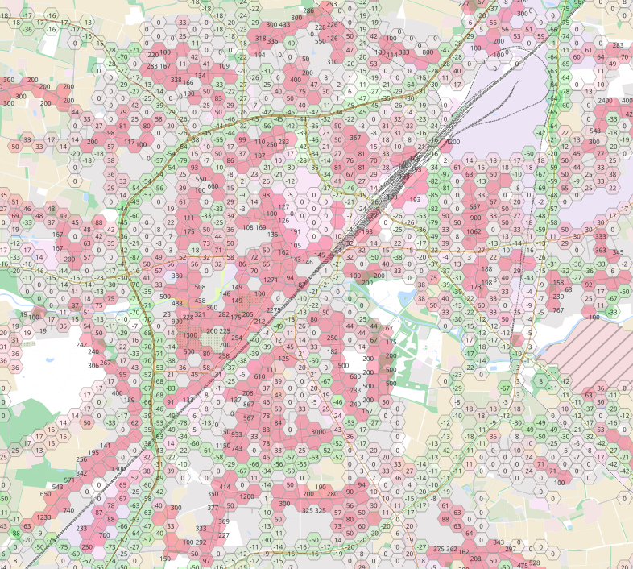

For statistical analysis of the redistribution of traffic this sub-tool calculates thousands
of random routes in the boundaries of your PBF file. 

Then it analyses which hexagons get touched how often before and after the routing change.

It then exports a postgis dump one may visualize with QGis or the like.

How to run
==========

You need a running docker and the prepared route comparison datasets up and running with
docker compose. We assume the frontend be reachable as **http://localhost:8080**

You need perl installed with **libfile-slurl-perl** **liblwp-useragent-perl** installed.

Then run 

	./prepare

What it does
============

It starts up a postgresql/postgis docker container. Then installed **osm2pgsql** and imports
the OSM Dataset. It then will gather all nodes which participate on the road network e.g.
highway residential, unclassified, tertiary, secondary, primary.

It will dump all those nodes to the **output/waypoints** file. 

Then the perl script will be run which reads the waypoints file and calculates 
a high number of random routes. All routes will be calculated with both datasets.
The script will itself dump the geojsons of these routes to **output/routes**

Afterwards the sql script **sql/importroutes.sql** will be executed which loads
all the routes into the postgis, creates a hexagon grid and matches routes to the grid.

Then the resulting hexagon grid will be dumped to **output/hexagon.sql**.

The resulting file can be imported into any postgis Database and visualized with QGis.
